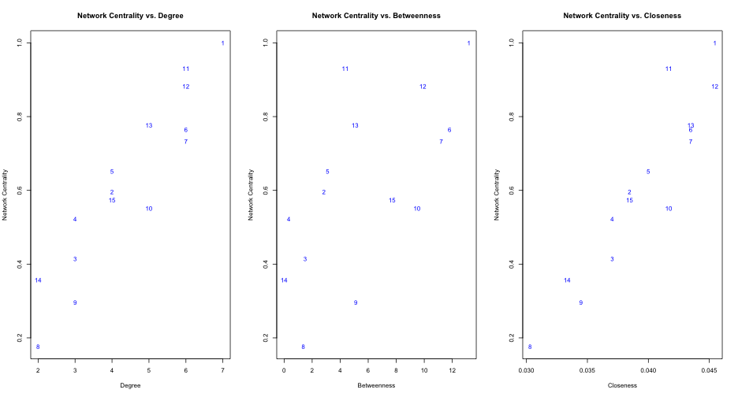

## The Key Statistical Technique is Social Network Analysis
SNA presents social relationships such as friendship and kinship in graphical form, consisting of nodes and edges.

<!---

-->

---

## Connections between Churners and Non-churners 
>  1. Churners **indirectly** connected through non-churners:

>  

>  2. Churners **directly** connected:

>  

---

## Prioritising Customers with a High Propensity to Churn

---

## Visualization of the Whole Network

---

## Key Network Attributes
>  1. Degree
>  2. Betweenness
>  3. Closeness

---

## Network Metrics

 

---

## Network Metrics (Degree)
<link rel='stylesheet' href=http://nvd3.org/assets/css/nv.d3.css>

 
 

---

## Network Metrics (Betweenness)

---

## Network Metrics (Closeness)

---

## Better Visualization of the Whole Network

---

## SNA Animation

---
